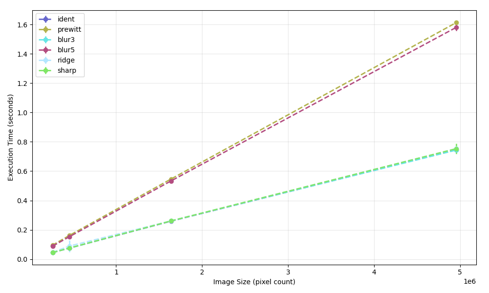
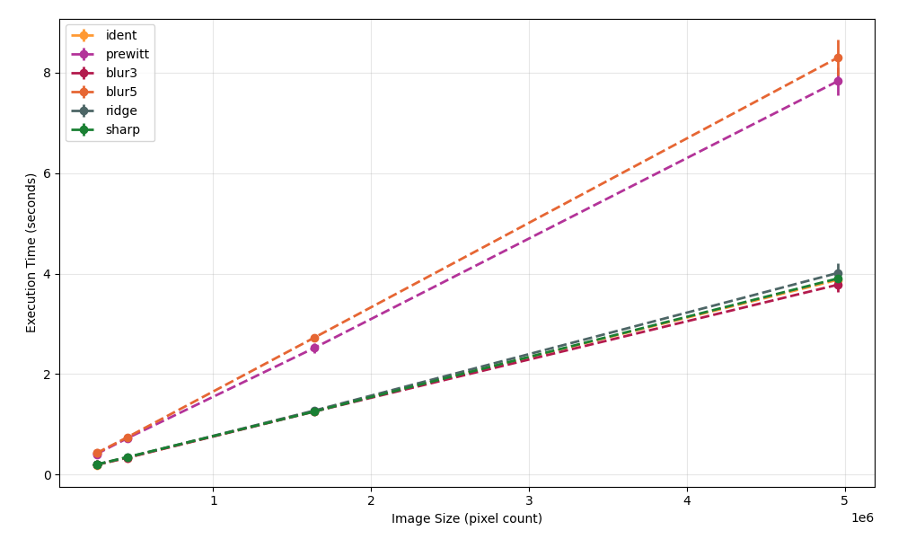

# Convolution

## How to start

You need the OpenMP library in order to compile.
Then, just run `make`
``` bash
make
```

The binary is in the `build` directory

## Graph plots
Intel(R) Core(TM) i7-10510U CPU @ 1.80GHz
RAM: 16 GB
OS: GNU/Linux 6.12.67_1
CC: gcc 14.2.1
CFLAGS: see Makefile for info

### Parallel
<p align="center">

</p>

### Sequential
<p align="center">

</p>
